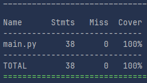

# qa_python

# Тесты для класса BooksCollector

Реализованы следующие тесты:
1. `test_add_new_book_add_two_books` - добавление двух разных книг в коллекцию.
2. `test_add_new_book_invalid_name_not_added` - книги с пустым именем или именем длиннее 40 символов не добавляются.
3. `test_add_new_book_duplicate_not_added` - повторное добавление той же книги не создаёт дубликат в словаре.
4. `test_add_new_book_added_without_genre` - новая добавленная книга имеет пустой жанр по умолчанию.
5. `test_set_book_genre_valid_genre_sets_correctly` - установка корректного жанра из списка genre успешно сохраняется.
6. `test_set_book_genre_invalid_genre_not_set` - попытка установить несуществующий жанр не меняет жанр книги.
7. `test_set_book_genre_nonexistent_book_not_set` - попытка установить жанр для книги, которой нет в коллекции, ничего не меняет.
8. `test_add_book_in_favorites_adds_existing_book` - добавление существующей книги в избранное успешно выполняется.
9. `test_add_book_in_favorites_nonexistent_book_not_added` - попытка добавить в избранное книгу, которой нет в коллекции, не выполняется.
10. `test_add_book_in_favorites_duplicate_not_added` - повторное добавление одной и той же книги в избранное не создаёт дубликат.
11. `test_delete_book_from_favorites_removes_book` - удаление книги из избранного успешно убирает её из списка.
12. `test_get_books_for_children_excludes_age_rated_genres` - метод возвращает только книги с жанрами, подходящими для детей.
13. `test_get_books_with_specific_genre_returns_correct_list` - метод возвращает правильный список книг для заданного жанра.
